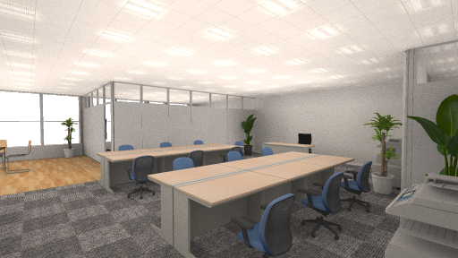
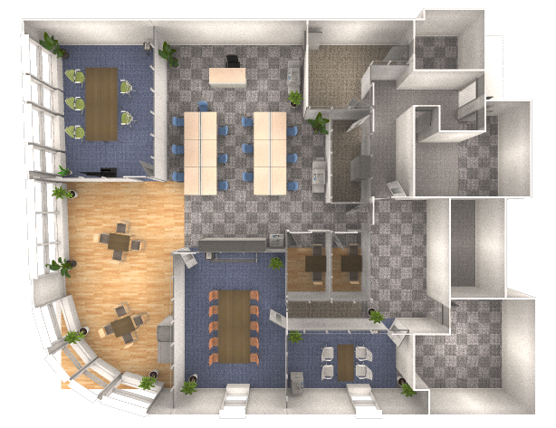

# RayGen Renderer

A simple, cross-platform ray tracing engine for 3D graphics rendering.

# Snapshots

<br />
Cube Room

<br />
Cube Room (Reflection Version)

<br />
Spheres & Materials

<br />
Suzanne (Glass)

<br />
Suzanne (Jade)

<br />
A real-life application: Office Rendering

<br />
A real-life application: Office Rendering (Top View)

# Build 

The following build scripts and projects are available in this repository:

| Platform | Folder | Build tool |
|---|---|---|
| macOS (Intel) | build/mac-intel | GNU Make |
| macOS (Apple Silicon) | build/mac-m | GNU Make |
| macOS | projects/raygen.xcodeproj | Xcode |
| Linux | build/linux | GNU Make |
| Windows | projects/raygen-win32/raygen.sln | Visual Studio |

Example of using GNU Make on Linux and macOS platforms:

```shell
cd build/<platform>
make
```

# Usage

```shell
$ ./raygen <command> <sceneFile.json> [output_image] [-options]
```
e.g.:
```shell
$ ./raygen render ../../resources/scenes/cubeRoom/cubeRoom.json -s 100 -enaa true
```

## Options

| Option | Description |
| --- | --- |
| -r, --resolution | Specifies the resolution of the output image. |
| -s, --samples | Number of samples (rays from the camera). |
| -c, --cores, --threads | Number of threads used for parallel rendering. |
| -ds, --dofs, --dof-samples | Number of samples for depth of field calculation. |
| -enaa, --enable-antialias | Enables ray-sample-based anti-aliasing (default: on). |
| -encs, --enable-color-sampling | Enables color sampling from textures (default: on). |
| -enpp, --enable-postprocess | Enables post-processing effects like bloom and gamma correction. |
| -d, --shader | Specifies the shading system (see below for options). |
| --focus-obj | Automatically sets the camera to focus on a specified object (by name). |
| --dump | Dumps the scene definition. |

Shading system: (specified by `-d` or `--shader` argument)

| Value | Name | Description |
|---|---|---|
| 0 | Simple Shading | Basic shading using Lambertian reflectance (no lighting or texture sampling). |
| 1 | Ambient Occlusion | Renders ambient occlusion only. | 
| 2 | Lambert Shading | Lambert shading with directional lighting and texture sampling. |
| 3 | Lambert Shading + AO | Lambert shading with directional lighting, texture sampling, and ambient occlusion. |
| 4 | (Reserved) | |
| 5 | BSDF | BSDF Shading with global illumination (default shading system). |

Shading system comparison:

| Value | Name | Directional Lighting | Indirect Lighting | AO | Global Illumination | Transparency | Reflection/Refraction | 
|---|---|---|---|---|---|---|---|
| 0 | Simple Shading | No | No | No | No | No | No |
| 1 | Ambient Occlusion | No | No | Yes | No | No | No |
| 2 | Lambert Shading | Yes | No | No | No | Yes | No |
| 3 | Lambert Shading + AO | Yes | No | Yes | No | Yes | No |
| 4 | (Reserved) | | | | | | |
| 5 | BSDF | Yes | Yes | Yes | Yes | Yes | Yes |

## Scene Format

A RayGen scene is described using a JSON file structured as follows:

scene.json:
```js
{
  obj1: {
    location: [x, y, z],
    angle: [x, y, z],
    scale: [x, y, z],
    mesh: "path/to/mesh.mesh",
    mat: {
      color: [r, g, b] or "#d0d0d0",
      tex: "path/to/texture.png",
      glossy: 0.0 to 1.0,
      roughness: 0.0 to 1.0,
      transparency: 0.0 to 1.0,
      refraction: 0.0 to 1.0,
      ...,
    }
  },
  obj2: {
    ...
  },
  ...
}
```

Description:

- `location`: Specifies the position of the object in 3D space.
- `angle`: Rotation of the object along the x, y, and z axes.
- `scale`: Scaling factors for the object along the x, y, and z axes.
- `mesh`: Path to the object's mesh file.
- `mat`: Material properties of the object:
  - `color`: RGB color values or a hexadecimal color code (e.g., "#d0d0d0").
  - `tex`: Path to the texture file.
  - `glossy`: Glossiness level, ranging from 0 (no gloss) to 1 (fully glossy).
  - `roughness`: Surface roughness, ranging from 0 (smooth) to 1 (rough).
  - `transparency`: Transparency level, ranging from 0 (opaque) to 1 (fully transparent).
  - `refraction`: Refraction index, ranging from 0 to 1.

# Mesh File Formats

RayGen supports the following mesh file formats:

- **RayGen Original Binary Mesh Format**: This format includes the mesh's data such as vertices, normals, texture coordinates, and more.
- **.obj File Format**: A widely-used 3D object file format. RayGen can read vertices, normals, faces, texture coordinates, and material information from .obj files.
- **FBX File Format**: Currently not supported but under development.

# Test Scenes

Several sample scenes for rendering can be found inside the `resources/scenes` folder:

- **Cube Room** - A well-known scene featuring two cubes, commonly used to benchmark ray-tracing engines.
- **Sphere Array** - A scene with five spheres demonstrating various material types.
- **suzanne** - The Suzanne model, used to showcase transparency and refraction materials.

# Dependency modules

The following modules are required to build this software and can be found in the `/inc` folder as git submodules:

- C++ Common Module (https://github.com/jingwood/cpp-common-class)
- C++ Graphics Module (https://github.com/jingwood/cpp-graphics-module)

# License

Released under the MIT License.

Copyright © Jingwood, unvell Inc. All Rights Reserved.
