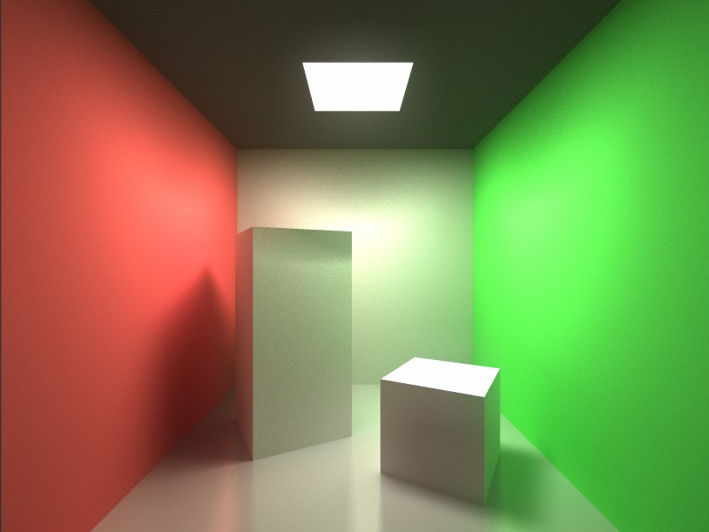
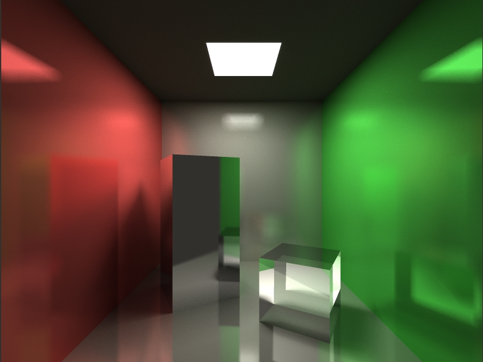
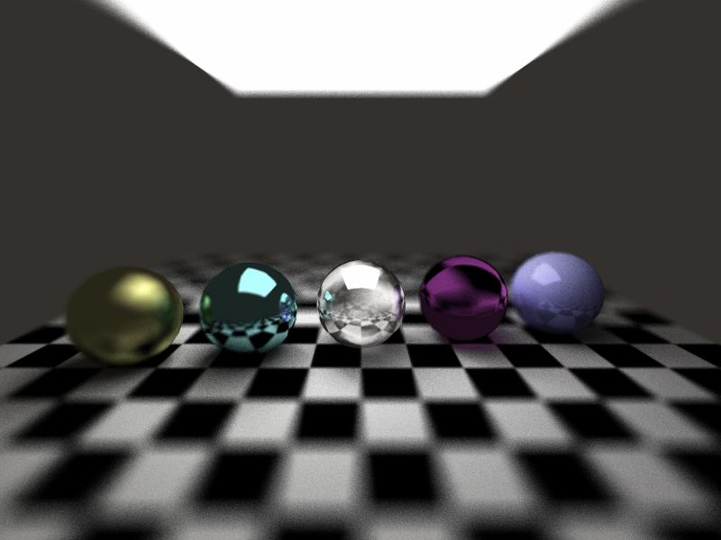

# RayGen Renderer

A simple cross-platform ray tracing engine for 3D graphics rendering.

# Snapshots

 
the cube room

 
the cube room (reflection version)

 
spheres & materials

 
suzanne glass

 
suzanne jade

# Development on Mac

Open `/projects/raygen.xcodeproj` by latest Xcode and run the project.
The rendered image will be saved to the folder where the scene file locates.

# Dependency libraries

- C++ Common Module (https://github.com/jingwood/cpp-common-class)
- C++ Graphics Module (https://github.com/jingwood/cpp-graphics-module)

# License

Released under MIT License.

Copyright © Jingwood & unvell.com, all Rights Reserved.
